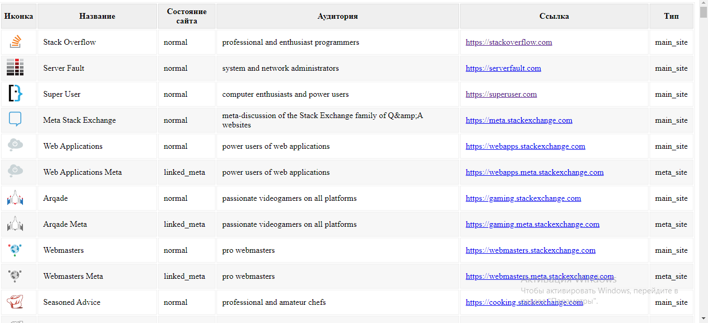

# Rest-api_Site_Stack_Overflow
A small tutorial project to display all sites with Stack Overflow. (Rest-api)

The project used such technologies and libraries:
* Spring
 1. Spring-boot
* Thymeleaf
* Lombok

The end result displays all sites with StackOverflow api in a table.

